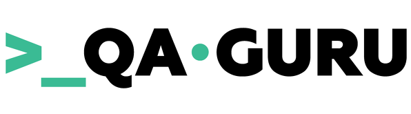

   <h1>
      Hi there!:wave:
   </h1>

<!--About me-->

## :technologist:About me
- I'm manual and automation Engineer from Cherepovets.
- Contacts:

  &#8287;&#8287;&#8287;&#8287;&#8287;
  
  &#8287;

<!--Education-->

## :man_student:Education
<table width="100%" border='0'>
   <tr> 
    <td width="30%" valign="bottom"></td><td valign="middle">Cherepovets State University.  Radiophysics. Wireless and computer technologies in the transmission and processing of information in digital systems</td></tr>
  </table>
   
  
  #### Additional Education:
<table width="100%" border='0'>
   <tr><td width="30%" valign="bottom"></td><td valign="middle">The International Software Testing Qualifications Board <a target="_blank" href="https://www.istqb.org">(ISTQB)</a>.</td></tr>
   
   <tr><td width="30%" valign="bottom"></td><td valign="middle">School of Test Automation Engineers <a target="_blank" href="https://qa.guru">qa.guru</a>.</td></tr>
   </tr>
  </table>
  
  
  
<!--Stack and tools-->

&#8287;&#8287;&#8287;&#8287;&#8287;
## :computer:Stack and tools

  <code></code>
  <code></code>
  <code></code>
  <code></code>
  <code></code>
  <code></code>
  <code></code>
  <code></code>
  <code></code>
  <code></code>
  <code></code>
  <code></code>
  <code></code>
  <code></code>
  <code></code>
  <code></code>
  <code></code>
  <code></code>

  
  
<!--Projects-->

## :floppy_disk:Projects
### UI autotests
#####  [WEB](https://github.com/Rammsat/github_web)

&#8287;&#8287;&#8287;&#8287;&#8287;
### API autotests
#####  [API](https://github.com/Rammsat/reqres_api)

&#8287;&#8287;&#8287;&#8287;&#8287;
### Mobile autotests
#####  [MOBILE](https://github.com/Rammsat/wiki_mobile)

<!--Git Stats-->

&#8287;&#8287;&#8287;&#8287;&#8287;
## :bar_chart:Git stats

 

